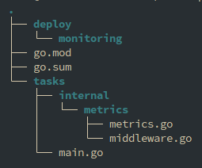
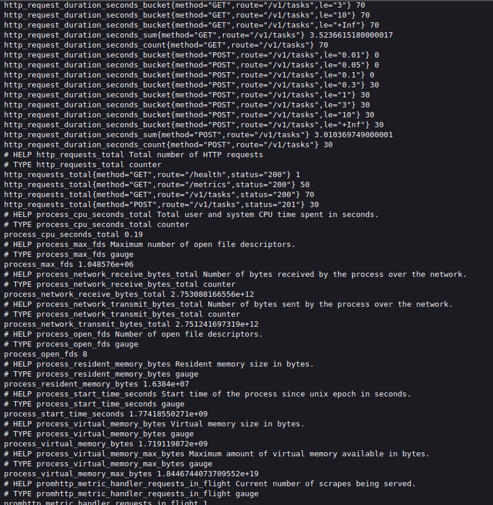
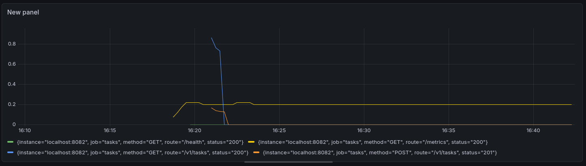
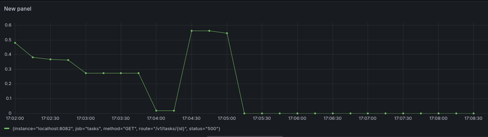
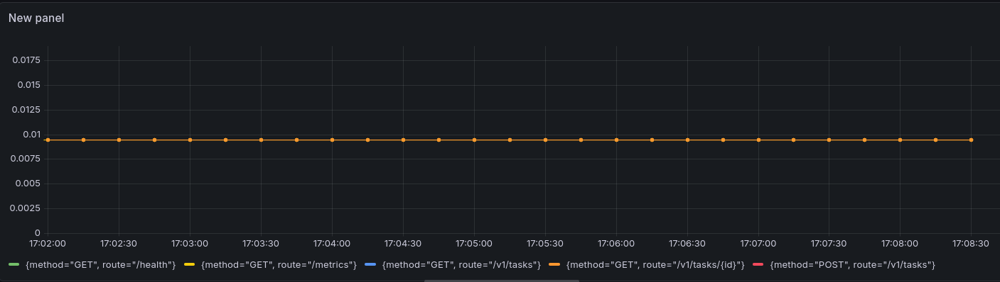
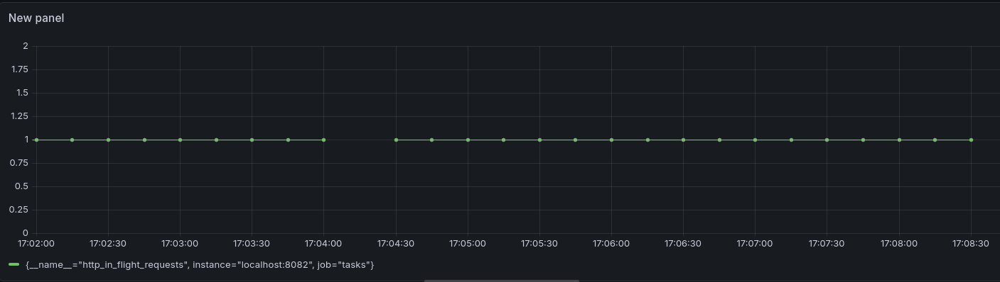

## Практическое занятие №4: Настройка Prometheus + Grafana для метрик. Интеграция с приложением

### Выполнил: Студент ЭФМО-02-25 Пягай Даниил Игоревич

---

## 1. Выбор инструментов мониторинга

Для сбора и визуализации метрик был выбран стек **Prometheus + Grafana**.

**Почему Prometheus:**
- Стандарт де-факто для сбора метрик в микросервисной архитектуре
- Pull-модель сбора данных
- Мощный язык запросов PromQL
- Легкая интеграция с приложениями на Go через client_golang

**Почему Grafana:**
- Мощная визуализация данных
- Поддержка множества источников данных
- Гибкая настройка дашбордов
- Бесплатная версия с богатым функционалом

---

## 2. Структура проекта

---

## 3. Реализованные метрики

| Метрика | Тип | Labels | Описание |
|---------|-----|--------|----------|
| `http_requests_total` | Counter | method, route, status | Общее количество HTTP запросов |
| `http_request_duration_seconds` | Histogram | method, route | Длительность HTTP запросов в секундах |
| `http_in_flight_requests` | Gauge | - | Текущее количество активных запросов |

## 4. Пример вывода

## 5. Графики

График №1: RPS (Requests Per Second)

График №2: Ошибки сервера 

График №3: Latency P95

График №4: Активные запросы

